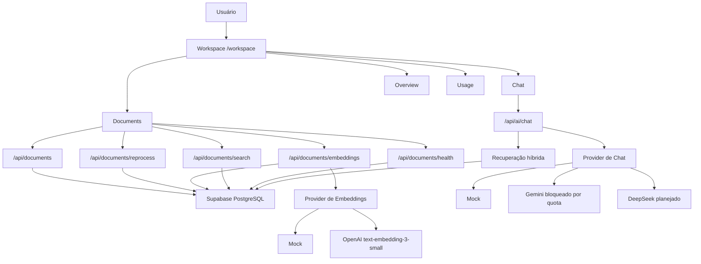

# Documento Técnico — SENSEI Data Engineer Mentor

Atualizado em: 2026-05-25  
Estado do projeto: v0.1-beta privada  
Última task concluída: TASK 047 — Visibilidade do provider de embeddings

## 1. Visão Geral

O SENSEI Data Engineer Mentor é uma aplicação privada de estudo e mentoria com IA, focada em acelerar a transição para Engenharia de Dados. O sistema combina workspace web, base documental própria, busca sobre fontes, histórico de conversas, preparação para embeddings reais e fluxo de recuperação híbrida para futuramente responder como mentor usando materiais cadastrados pelo usuário.

O objetivo prático é ter uma ferramenta pessoal para:

- organizar materiais de estudo;
- cadastrar fontes técnicas relevantes;
- transformar documentos em chunks pesquisáveis;
- buscar trechos por termos e vetores;
- conversar com um mentor de IA usando a própria base;
- registrar progresso, histórico e uso;
- gerar um portfólio técnico demonstrável.

## 2. Escopo Atual

O projeto está em modo single-user/private. Não há uso público planejado neste momento. A aplicação está publicada na Vercel e protegida por senha nas rotas privadas.

O sistema já possui:

- aplicação Next.js com TypeScript;
- workspace com navegação interna;
- chat mock funcional;
- persistência de histórico em Supabase quando configurado;
- cadastro manual de documentos/fontes;
- ingestão de conteúdo bruto textual;
- geração automática de chunks;
- busca lexical sobre chunks;
- fundação pgvector;
- geração mock de embeddings;
- fundação de embeddings reais via OpenAI;
- recuperação híbrida lexical + vetorial;
- health documental;
- fila de embeddings observável;
- evals de recuperação;
- smoke test de recuperação no overview;
- proteção privada via HTTP Basic Auth;
- RLS habilitado nas tabelas Supabase do app;
- deploy de produção na Vercel.

## 3. Stack Técnica

### Frontend e aplicação

- Next.js App Router
- React
- TypeScript
- Tailwind CSS
- ESLint
- pnpm

### Backend e APIs

- Next.js Route Handlers
- APIs internas em `src/app/api/*`
- Proxy/Middleware para proteção privada
- Server-side Supabase client com service role apenas no servidor

### Banco e dados

- Supabase remoto
- PostgreSQL
- pgvector
- Row Level Security habilitado
- Tabelas principais:
  - `app_settings`
  - `chat_threads`
  - `chat_messages`
  - `usage_events`
  - `documents`
  - `document_chunks`

### IA e embeddings

- Provider mock como fallback operacional
- Gemini integrado tecnicamente, mas bloqueado por quota/billing
- OpenAI embeddings preparado para `text-embedding-3-small`
- DeepSeek considerado para chat/mentor real em etapa futura
- Nenhum segredo é commitado no repositório

### Deploy e operação

- Vercel para hospedagem
- GitHub privado como repositório
- Supabase para banco e futuramente storage
- Variáveis de ambiente na Vercel para segredos

## 4. Arquitetura Funcional

## 5. Fluxo Prático de Uso

O fluxo esperado quando o sistema estiver operacional é:

1. O usuário acessa o workspace privado.
2. Cadastra fontes/documentos em `/workspace/documents`.
3. O sistema salva metadados e conteúdo bruto no Supabase.
4. O conteúdo bruto é dividido em chunks.
5. Os chunks recebem embeddings.
6. A busca encontra trechos relevantes por termos e similaridade vetorial.
7. O chat usa os trechos recuperados como contexto.
8. O mentor responde com base nos documentos do usuário.
9. O histórico de conversas fica salvo.
10. O usuário acompanha health, pendências e uso/custo.

## 6. Segurança

O sistema segue modelo privado/single-user.

Medidas já implementadas:

- rotas `/workspace`, `/api/chat/*`, `/api/ai/*` e `/api/documents/*` protegidas por senha quando `SENSEI_PRIVATE_ACCESS_PASSWORD` está configurada;
- RLS habilitado nas tabelas do app;
- APIs internas usam `SUPABASE_SERVICE_ROLE_KEY` apenas server-side;
- anon key pública não deve permitir leitura/escrita direta nas tabelas protegidas;
- segredos ficam fora do Git;
- `.env.local` não deve ser commitado;
- Vercel Environment Variables centraliza segredos de produção.

Riscos que continuam exigindo atenção:

- manter service role fora do browser;
- não expor chaves reais em prints, commits ou chat;
- validar RLS depois de novas migrations;
- limitar custo de providers reais;
- manter o app privado enquanto não houver autenticação multi-user robusta.

## 7. Estado Atual por Módulo

### Workspace

Implementado com páginas principais:

- `/workspace`
- `/workspace/chat`
- `/workspace/documents`
- `/workspace/usage`
- `/workspace/settings`

O overview já mostra health documental, prontidão de recuperação e smoke test de busca.

### Documentos

Implementado:

- cadastro manual de fonte;
- edição básica;
- remoção;
- importação local de `.txt`, `.md` e `.markdown`;
- conteúdo bruto;
- hash;
- contagem de caracteres;
- status de ingestão;
- filtros e contadores;
- reprocessamento individual e em lote.

Ainda falta:

- upload físico de arquivo;
- armazenamento do arquivo original;
- parsing de PDF/DOCX/HTML;
- OCR;
- histórico/versionamento de edições.

### Chunks e Recuperação

Implementado:

- geração de chunks a partir de `raw_content`;
- busca lexical/local;
- ranking por frase, termos relevantes e score simples;
- busca vetorial com pgvector;
- recuperação híbrida lexical + vetorial;
- diagnóstico de recuperação exibido no chat mock;
- eval manual;
- dataset e fixtures versionados;
- smoke test de recuperação no overview.

Ainda falta:

- calibragem fina de pesos lexical/vetorial;
- validação com documentos reais;
- evals mais amplos;
- uso definitivo no chat real.

### Embeddings

Implementado:

- provider mock;
- fundação OpenAI opcional;
- modelo padrão `text-embedding-3-small`;
- filtro de provider/model na busca vetorial;
- fila de embeddings observável;
- status de provider/modelo na UI.

Ainda falta:

- configurar `EMBEDDINGS_PROVIDER=openai` em produção;
- configurar `OPENAI_API_KEY` segura na Vercel;
- validar geração real com documentos reais;
- definir procedimento de regeneração quando mudar provider/modelo.

### Chat

Implementado:

- UI de chat;
- provider mock;
- persistência local;
- persistência Supabase quando configurada;
- histórico mínimo;
- consulta a chunks recuperados;
- diagnóstico visual da recuperação.

Ainda falta:

- provider real de resposta em produção;
- prompt final de mentor;
- citações de fontes;
- melhor organização de conversas;
- streaming;
- controle persistente de custo/uso.

### Uso e Custos

Implementado:

- guardrails locais em memória;
- estimativa de tokens/custos por chamada real;
- página `/workspace/usage` básica.

Ainda falta:

- persistir eventos de uso em banco;
- dashboard real de custos;
- limites mensais configuráveis;
- alerta de gasto;
- uso de DeepSeek para chat real, se escolhido.

## 8. Sistemas Externos Usados

### Vercel

Responsável por:

- deploy de produção;
- build Next.js;
- hospedagem;
- variáveis de ambiente;
- domínio `sensei-data-engineer-mentor.vercel.app`.

### Supabase

Responsável por:

- PostgreSQL;
- tabelas do app;
- pgvector;
- RLS;
- persistência de documentos, chunks, chat e eventos futuros;
- possível storage de arquivos originais em etapa futura.

### OpenAI

Planejado para:

- embeddings reais com `text-embedding-3-small`.

Uso esperado:

- custo baixo;
- apenas backend;
- chave em variável segura;
- processamento por volume de texto.

### DeepSeek

Planejado como opção para:

- respostas do mentor/chat real;
- uso dos créditos já disponíveis na conta do usuário.

Observação:

- não está confirmado como provider de embeddings no projeto atual;
- deve ser tratado como provider de chat/LLM, não como substituto direto dos embeddings OpenAI.

### GitHub

Responsável por:

- versionamento;
- repositório privado;
- histórico de commits;
- possível abertura de PRs no futuro.

## 9. Variáveis de Ambiente Principais

### Já usadas

- `NEXT_PUBLIC_SUPABASE_URL`
- `NEXT_PUBLIC_SUPABASE_ANON_KEY`
- `SUPABASE_SERVICE_ROLE_KEY`
- `SENSEI_PRIVATE_ACCESS_PASSWORD`
- `AI_PROVIDER`
- `GEMINI_API_KEY`

### Preparadas ou necessárias para próximas etapas

- `EMBEDDINGS_PROVIDER`
- `OPENAI_API_KEY`
- `OPENAI_EMBEDDING_MODEL`
- variável futura para DeepSeek, por exemplo `DEEPSEEK_API_KEY`
- variável futura para selecionar provider de chat real

## 10. Estimativa de Custos

Para uso privado inicial, a expectativa é manter custos baixos.

### Provável no começo

- Vercel Hobby: US$ 0
- Supabase Free Tier: US$ 0
- OpenAI embeddings: centavos a menos de US$ 1 para muitos testes iniciais
- DeepSeek chat: usar saldo já existente

### Maior risco de custo

O custo maior tende a vir do chat real, não dos embeddings. Por isso, o plano recomendado é:

1. usar OpenAI apenas para embeddings;
2. usar DeepSeek para respostas do mentor;
3. manter limites e observabilidade de uso;
4. processar poucos documentos no primeiro ciclo.

## 11. Etapas Restantes Até 100% Operacional

### TASK 048 — Configurar embeddings reais em produção

Configurar na Vercel:

- `EMBEDDINGS_PROVIDER=openai`
- `OPENAI_API_KEY`
- `OPENAI_EMBEDDING_MODEL=text-embedding-3-small`

Critério de pronto:

- UI mostra provider OpenAI disponível;
- API protegida responde com provider/modelo correto;
- geração real deixa chunks como `embedded`.

### TASK 049 — Validar embeddings reais ponta a ponta

Usar documentos reais pequenos para validar:

- cadastro;
- chunking;
- geração de embeddings OpenAI;
- busca vetorial;
- recuperação híbrida.

Critério de pronto:

- consulta semântica encontra trechos relevantes mesmo com palavras diferentes.

### TASK 050 — Ajustar busca híbrida para uso real

Refinar:

- pesos lexical/vetorial;
- limites de resultados;
- filtros por provider/model;
- diagnóstico de ranking.

Critério de pronto:

- top resultados fazem sentido em evals e testes manuais.

### TASK 051 — Conectar chat ao RAG real

Fazer o chat usar a recuperação como contexto real da resposta.

Critério de pronto:

- resposta do mentor considera fontes recuperadas;
- resposta indica quando não há fonte suficiente;
- fallback mock continua seguro.

### TASK 052 — Implementar provider real de chat

Escolher e configurar provider real, com preferência prática por DeepSeek se os créditos forem usados.

Critério de pronto:

- provider real responde em produção;
- chave fica apenas em variável segura;
- guardrails de custo continuam ativos.

### TASK 053 — Ajustar persona/prompt do mentor

Definir comportamento final do mentor:

- focado em Engenharia de Dados;
- didático;
- objetivo;
- com plano de estudo;
- citando fontes quando houver contexto.

Critério de pronto:

- respostas seguem padrão consistente e útil.

### TASK 054 — Upload e parsing de PDF

Adicionar suporte a PDF.

Critério de pronto:

- usuário seleciona PDF;
- sistema extrai texto;
- texto vira documento/chunks;
- erros de parsing são claros.

### TASK 055 — Storage de arquivos originais

Implementar armazenamento dos arquivos originais, provavelmente com Supabase Storage.

Critério de pronto:

- arquivo original fica salvo;
- documento referencia o arquivo;
- exclusão/reprocessamento respeitam o vínculo.

### TASK 056 — Tela de manutenção da base

Melhorar operações de manutenção:

- documentos com erro;
- chunks pendentes;
- embeddings faltantes;
- reprocessamento;
- regeneração de embeddings;
- status por documento.

Critério de pronto:

- usuário consegue diagnosticar e corrigir problemas sem mexer no banco.

### TASK 057 — Histórico e organização das conversas

Melhorar:

- títulos automáticos;
- arquivamento;
- retomada de conversas;
- filtro/busca no histórico;
- vínculo opcional com documentos usados.

Critério de pronto:

- conversas ficam fáceis de recuperar e continuar.

### TASK 058 — Observabilidade persistente de uso/custo

Persistir uso em banco:

- chamadas;
- tokens estimados;
- provider;
- modelo;
- custo estimado;
- status/falhas.

Critério de pronto:

- `/workspace/usage` mostra dados persistentes e úteis.

### TASK 059 — QA final operacional

Testar fluxo completo:

1. cadastrar documento;
2. gerar chunks;
3. gerar embeddings;
4. buscar;
5. conversar;
6. validar fontes;
7. ver histórico;
8. conferir proteção privada;
9. conferir custos.

Critério de pronto:

- sistema funciona ponta a ponta em produção.

### TASK 060 — Documentação final e manual de operação

Criar documentação final:

- manual de uso;
- checklist de manutenção;
- variáveis de ambiente;
- fluxo de backup;
- custos esperados;
- troubleshooting.

Critério de pronto:

- usuário consegue operar o sistema sem depender do histórico de chat.

## 12. Definição de 100% Operacional

O sistema será considerado 100% operacional para uso privado quando:

- aceitar documentos reais;
- extrair ou receber conteúdo textual;
- gerar chunks;
- gerar embeddings reais;
- buscar trechos relevantes;
- responder no chat com provider real;
- usar fontes como contexto;
- salvar histórico;
- proteger acesso privado;
- mostrar health e pendências;
- registrar uso/custo;
- ter documentação de operação.

## 13. Próxima Ação Recomendada

A próxima etapa técnica recomendada continua sendo a TASK 048: configurar embeddings reais em produção.

Porém, essa task depende de uma chave OpenAI API. Caso o objetivo seja evitar OpenAI por enquanto, a alternativa é alterar o plano e seguir para TASK 052 primeiro, implementando DeepSeek como provider real de chat, mantendo embeddings mock até decidir a estratégia semântica definitiva.
